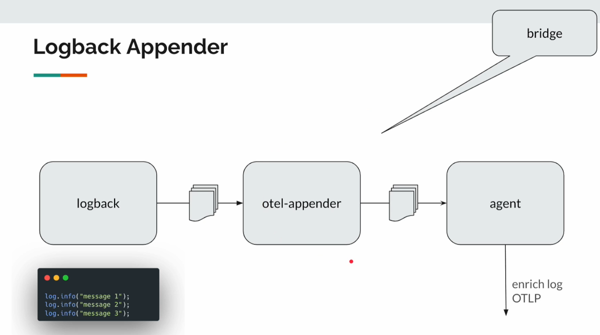

# monitoring-application

## Problem 1: Tracing - Parent Child Relationship

We will have trace parent, because there are many concurrent requests in an api calling, 
we need something to keep track it:

- version:
- trace id: is shared across all the spans
- span id:
- trace flag:


## Problem 2: Average Response time for all request for last 1 minute

rate(http_server_requests_seconds_sum[1m]) / rate(http_server_requests_seconds_count[1m])


## Problem 3: Collect logs for microservice, each service maybe have many instances, and many thread executed in the service

Collects logs from all services and instances into a centralized system using the OpenTelemetry Collector.

## Problem 4: THere is no communication between logback and agent, we need a bridge



- To send the logs to the collector, e have to make a couple of simple changes in our application:

1. Need to add opentelemetry logback appender into pom.xml:

```xml
        <dependency>
            <groupId>io.opentelemetry.instrumentation</groupId>
            <artifactId>opentelemetry-logback-appender-1.0</artifactId>
        </dependency>

```

2. Need a logback xml to use opentelemetry appender:

```xml 
<configuration>

    <!-- Console Appender -->
    <appender name="CONSOLE" class="ch.qos.logback.core.ConsoleAppender">
        <encoder>
            <pattern>%d{HH:mm:ss.SSS} %-5level [%15.15t] %cyan(%-30.30logger{30}) : %m%n</pattern>
        </encoder>
    </appender>

    <!-- OpenTelemetry-Collector Appender -->
    <appender name="OTLP" class="io.opentelemetry.instrumentation.logback.appender.v1_0.OpenTelemetryAppender"/>

    <root level="INFO">
        <appender-ref ref="CONSOLE"/>
        <appender-ref ref="OTLP"/>
    </root>

</configuration>

```