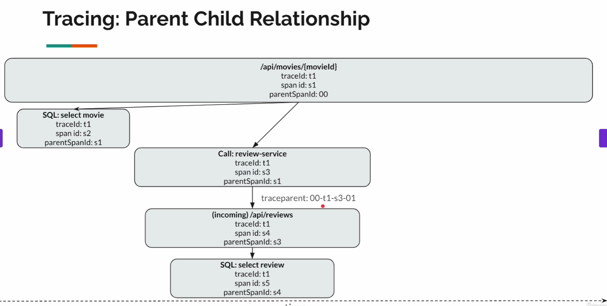
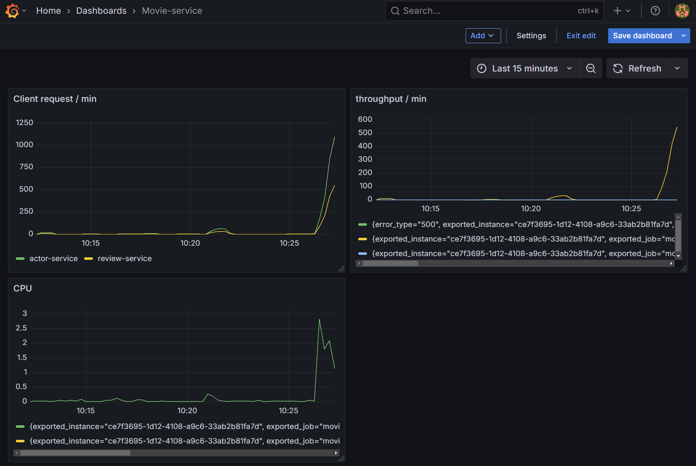

# monitoring-application

## Problem 1: Tracing - Parent Child Relationship

We will have trace parent, because there are many concurrent requests in an api calling, 
we need something to keep track it:

- version:
- trace id: is shared across all the spans
- span id:
- trace flag:

## Problem 2: Average Response time for all request for last 1 minute

rate(http_server_requests_seconds_sum[1m]) / rate(http_server_requests_seconds_count[1m])

